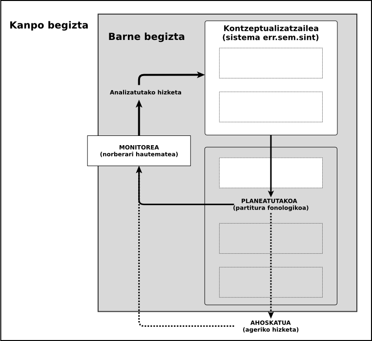
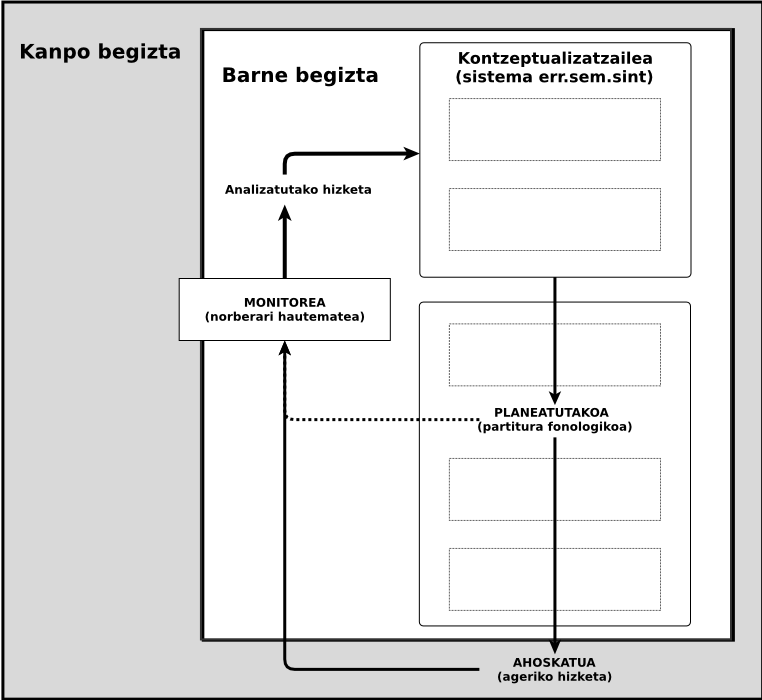
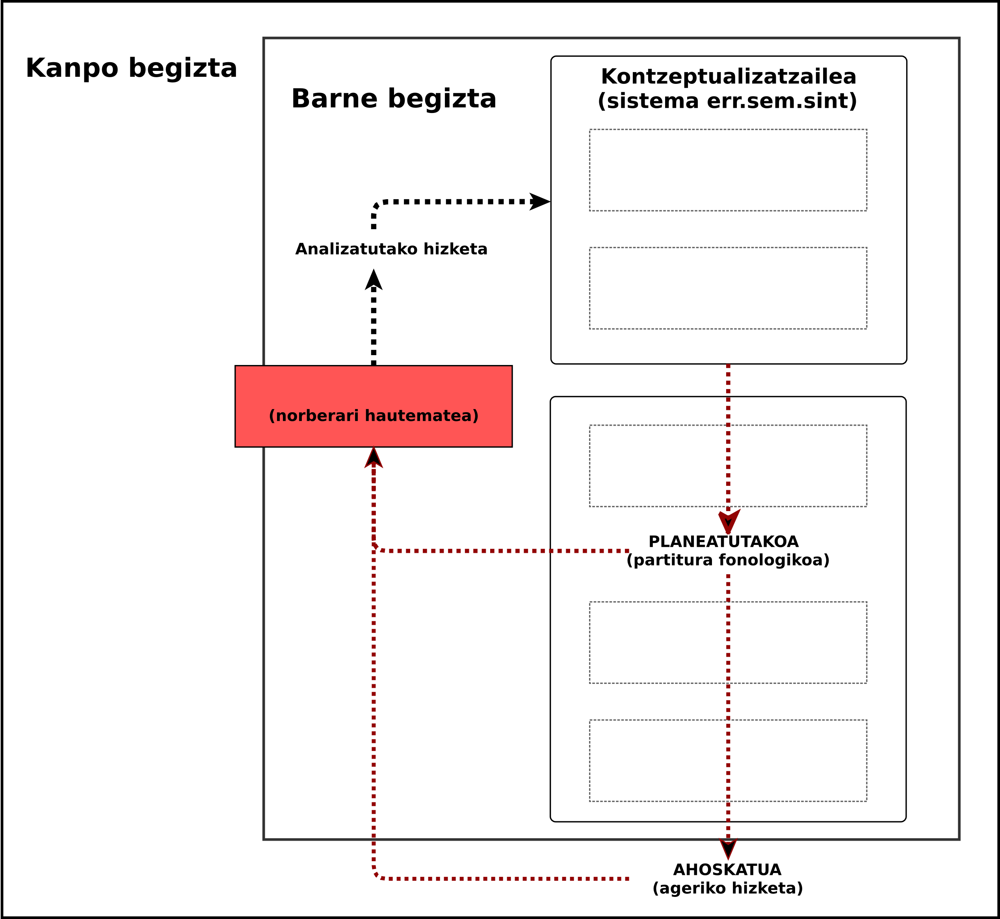

## Zailtasunak adizki jokatuaren inguruan B2-C1 ibilbidean

### Bilakaera kasu baten analisia

note:
Eskerrak tribunalari etorri dira-eta

---

### Hasierarako ibilbidea

note:
**3'**  
Euskalduntzen hastearekin bateratsu irakaslea  
Ikastea eta irakastearen arteko **sinbiosia**.

Euskara-**ikastun - irakasle**  
(intuizioa) *Euskaraz pentsatzeko euskarazko elementuak*  
Euskaraz *berbetan eta pentsatzen* nola ikasten den jakin nahi.

Euskara **irakasle - ikertzaile amateurra**  
Adizkiak erabiltzen nola ikasten den jakin nahi izatera.

**Irakasle eta ikertzaile** kontratua. Profesional egin nahirik.  
Zehatzago izan behar zuen: nola ikasten da adizkia ipintzen? Eta zerk ez du uzten horixe ikasten? Eta zer ikasten da? 

---

### (zailtasunak + adizkiak) x ikastea

note:
Abiapuntua hori izan zen.

**Helmuga IKERKETA HAU** Helburuak 
Euskalduntzen ari den heldu batek aditzak nola jokatzen dituen. Eta gaitasun komunikatiboan aurrera egiteak erabilera horretan zer eragiten duen aztertzen duena.

---

##### Marko teorikoa
##### Hipotesiak
##### Marko metodologikoa
##### Azterketa
##### Interpretazioa
##### Ondorioak

note:
Txosten idatziaren egiturarekin bat eginda, azalduko dut.

oinarri teorikoak -> hipotesiak -> marko metodologikoa ...

---

##### Marko teorikoa
##### Hipotesiak
##### Marko metodologikoa
##### Azterketa
##### Interpretazioa
##### Ondorioak

---

## Zailtasunak adizki jokatuaren inguruan B2-C1 ibilbidean

+++?image=https://raw.githubusercontent.com/JuanAbasolo/irudiak/master/A01-EHnEuskara.png&size=auto 95%

+++

### Heldu euskaldunduak

|urtea| 1991 | 2014 |
|:-:|---:|---:|
|adin tartea| 16-24 | 35-49 |
|euskaldunak| % 26.4 | % 29.3 |
|heldu euskaldunduak|| ~ % 12.9 ?|

 

**HABEko azterketak 2014**
* B2 (erabiltzaile independentea) 1350 gai
* C1 (erabiltzaile gaitua) 720 gai

+++

### Curriculum idatziak eta euskalduntze prozesua

|HEOC|Euskalduntzea|
|:---:|:---:|
|Diseinua|Gauzapena|
|Estudiatzea|Ikastea|
|Zer jakin|Zertan jakin|

+++?image=https://raw.githubusercontent.com/JuanAbasolo/irudiak/master/BaVsHEOC.png&size=auto 70%

note:
HEOK eta HEOC-en egitura oso antzerakoak. 

---

### Euskarazko adizki jokatua nola ikasten da erabiltzen?

Aditz erroa · 
Aspektua · 
**Pertsona** · 
**Numeroa** · 
**Modua** · 
**Tenpusa**

### Nik zuri liburuak gaur _eman**go nizkizuke**_

### Lanean _**dihardut**_ 

note:
Jakin dezakegu nola irakasten den nola erabiltzen den, baina ez dakigu nola ikasten den erabiltzen euskalduntze prozesuan.

Badakigu, Barreñak hasitako bidetik, agerrera mailakatua dutela jabekuntza prozesuan.

Baina, Esnal-ek *(aditzaren arloa dugu euskal hizkuntz
formen artean egituratuenetarikoa)* horregatik errore gutxi hizkuntz formetan aditz jokatuan.

Perezek: konpletiboa eta pluralarekiko komunztadura.

---

## Zailtasunak = zalantzak + zuzenketak + erroreak

note:
Levelt'ek proposatutako **hiztunaren ekoizpen eredua**ri de Bot-ek egindako elebidunarentzako oharrak  kontuan izanda Segalowitzek ereduaren proposamen bat egin zuen, etorri-etenen jatorriak identifikatzeko.

+++?image=Levelten_eredua_Nik-garden.png&size=auto 90%

note:
Hiztunak hizketa **monitorizatzen** du. 
Krashen'ek 1977  
Leveltek 1989  
Esatekoa eta esandakoa. Monitorizazio horrek begizta bi ditu, batean esateko eta bestean esandakoa aztertzen da.

+++

### Zailtasunak = zalantzak + zuzenketak + erroreak

+++

Soinu luzatuak

Silabatze markatuak

? Eten beteak

? Eten isilak

? Errepikapenak

+++

### Zailtasunak = zalantzak + zuzenketak + erroreak

+++

? Errepikapenak

Osatu gabeko berbak

Birformulazioak

note:
Birfomulazioa = ageriko autozuzenketa

+++

### Zailtasunak = zalantzak + zuzenketak + erroreak

note:

* erroreak garapenean / ikaskuntza prosezuan
* erroreak (errakuntzak)

Sailkapena:

* Eza (zerbaiten falta)
* Gehitzea (zerbait sobran)
* Alegiazko hautua (okerreko elementua hautatzea)
* Okerreko ordena

+++

## Zailtasunen
# Continuuma

### zalantzak ←→ zuzenketak ←→ erroreak

---

## "..inguruan"? 

|horrek |eeeez |zion |esan|
|--|:--:|:--:|--|
|-|luz|hurrengoa| |

note: 
gero azalduko da metodologian

---

##### Marko teorikoa
##### Hipotesiak
##### Marko metodologikoa
##### Azterketa
##### Interpretazioa
##### Ondorioak

---

### Hipotesiak

note:
**10'**

+++

### Hipotesi orokorra

> Ikasleak komunikazio gaitasuna garatu ahala bere baitako gaitasun linguistikoa ere garatuko duenez, gramatika ezaugarriek adizki jokatuen ekoizpenean eragiten dizkien zailtasunak urritu egingo dira

note:
Canalek eta Swainek gramatika gaitasuna deskribatzen hasi zirenetik...
Soto-Vallek ume euskaldunen kasuan baieztatzen duenarekin bat etorriko litzateke.

+++

### Hipotesi zehatzak

+++

##### Ikuspegi orokorretik hartuta

> H1 : **Zailtasun adierazleen banaketa aldatu**ko da adizki jokatua, adizki nagusia, aditz argumentu ala beste ezer izan.

note:
Levelt-ek lemen eta kodetze sintaktikoa une desberdinetan, beraz...

+++

##### Aditz nagusian eta laguntzailean

> H2 : **Adizki laguntzailearen inguruan zailtasun adierazle gehiago** egongo dira **aditz nagusiaren inguruan baino**.

note:
Aditz nagusia eta adizki laguntzailea une desberdinetan kodetu (mikrplangintza eta kodetze gramatikala), beraz... 

+++

##### Adizki jokatuaren aurreko etenaz

> H3 : **Zailtasun** adierazleen banaketa eta **adizki jokatuaren aurreko etena**rena erlazionatuta egongo dira.

note:
Galdegaigunea eta aditzaren artean unitatea sortu (Gaminde) behar...

+++

##### Erroreak eta errakuntzak

> H4 : Nahiz eta arauen araberako adizkiak batzuetan sortu ez, horiek **ez dira erroreak** izango, huts egiteak baino; sortu behar zituzkeen adizki horiek arauen arabera ere aurkituko baititugu B2 mailatik gora dabilen ikastunaren ekoizpenean.

note:
HEOC-ek B2rako eta Corder-rek zehazten duen huts egite eta garapenezko erroreen arteko aldea...

+++

##### Ezaugarri zailak

> H5 : **Bada ezaugarri** morfologiko, semantiko eta pragmatiko **multzo bat** zeinetan adizki jokatuaren inguruko zailtasunek banaketa bereizia duten.

note:

Ezaugarri batzuk zailagoak, forma batzuk eskuratzen zailagoak izango direlako. Segalowitz, Paradis (H2ko ikastun berantiarrak ez du eraikitzen formarik)

*Ezaugarri morfologikoak*

H5a : Adizki jokatuaren inguruan zailtasun adierazle gehiago agertuko dira **adizki markatuekin** ez markatuekin baino.

*Ezaugarri semantikoak*

H5b : **Adizki jokatu inergatiboak** zailtasun adierazle gehiago izango ditu inguruan, ergatiboak eta inakusatiboak baino.  
H5c : **Aditz perifrastikoetan zailtasun adierazle gehiago** egongo dira adizki jokatuaren inguruan, aditz trinkoetan baino.

*Ezaugarri pragmatikoak*

H5d : **Gertaldi gutxiagoko adizki formek zailtasun adierazle gehiago** izango dituzte inguruan, gertaldi gehiagokoek baino.  
H5e : Adizki jokatuaren inguruko **zailtasunak gutxiago** izango dira, **aditz argumentuak formulatuta** daudenean.  
H5f : **Aditz argumentuak formulatzen direnetik** zenbat eta denbora gehiago pasatu, zailtasun adierazle gehiago ikusiko dira adizki jokatuaren inguruan

+++

##### Bilakaera

> H6 : Adizki jokatuaren inguruan **zailtasun adierazle gutxiago** egongo dira **eta urrunago**, mailaz igo ahala.

note:
**16'**

Europako Hizkuntzen Marko Bateratua, HEOC...  
Gaminde, Alberdi eta Goikoetxea.

---

##### Marko teorikoa
##### Hipotesiak
##### Marko metodologikoa
##### Azterketa
##### Interpretazioa
##### Ondorioak

note:
Aipatutako hipotesiok egiaztatzeko aukeratutako metodologia eta diseinua

---

### Subjektu Bakarreko Diseinua

Neurketa sistematikoa aldi desberdinduetan.

note:
EHUn gutxi erabilia, antza, ibilbide handia beste inguru batzuetan.  
Single Subject Research  
Single Case Research  Kratochwill + Kazdin (What Works Clearinghouse)  
Sugai-k hezkuntza elebidunean 1987

Elementuak bakarka aztertzen ditu. Horretarako, delako ezaugarria neurtzen da aldi desberdinetan

Gehitze errorea. Lanetik aterata

---

### Datuak

Note:

Barnetegian  
Ikastun bat, jardun formalean  
Aurrez prestatutako 13 monologo  
330 egunean zehar  
1000 klase orduan

---

#### Transkripzioak 

##### Praat

note:
Praat doing Phonetics by Computer.
Amsterdamgo Unibertsitatean garatutakoa.

---

##### Etiketak
  * Zailtasun adierazleak
  * Etiketa sintaktikoak-eta beste

##### Banaketa kokatu

 hori| (·) |esaaaan |zidan
 :-:|:-:|:-:|:-:
 -|eten 0| eten 1| eten 2
 -|-| luzatua 0 |  luzatua 1 
 ABS   argumentua | - | aditz nagusia | adizki jokatua  

##### Banaketaren analisia

note: 
## Praat

Informazio aberatsa (soinuaren ezaugarri fisikoez)

## Etiketak 

Zailtasun adierazleak:

* soinu luzatuak
* errepikapena
* berba zatiak
* erroreak
* ...

Etiketa sintaktikoak-eta

* Adizki jokatua
* Adizki nagusia
* Aditz argumentua (zein)
* Beste
* Amaiera tonua
* Formulazioaren amaiera

## Banaketa kokatu

* transkripzioaren datuak LibreOffice calc-era. Bertan kalkulatu besteak.

---

##### Marko teorikoa
##### Hipotesiak
##### Marko metodologikoa
##### Azterketa
##### Interpretazioa
##### Ondorioak

---

### Zailtasunen banaketa corpuseko elementuetan

note:
Eta honetan zer ikusten da?  
Ikastun honek soinua luzatzen badu, aukeren herena dela hurrengo esaten duena adizki jokatua izateko.  

Silabak markatzen baditu, berriz, erdietan hurrengoa adizki jokatua.  

---

### Zailtasunak adizkiaren inguruan

+++

#### Aditz nagusian Vs adizki jokatuan

---

### Erroreak errakuntza

huts egindako   helburu forma | asmatua | baliokidea(k)
:-:|:-:|:-:
dituzte|dituzte
ditut | - | ditugula / nituzke
zidaten|-|?

---

### Adizki jokatuen ezaugarriak eta zailtasunak

---

### Zailtasunen agerreraren bilakaera

---

##### Marko teorikoa
##### Hipotesiak
##### Marko metodologikoa
##### Azterketa
##### Interpretazioa
##### Ondorioak

---

## Interpretazioa

note:
Adizkiak ekoiztea eta erabiltzea zaila da ikasle honentzat, behintzat. 

+++

> (*nikpro*) kirol gehiago egiten egiten dut

note:
*kirol gehiago* eta *egiten* erraz. Ez dakigu, baina, zer dagoen horren atzean.

+++

Zailtasunak taldeka

> entzuteeen (0.8seg) eeh dugu

+++

Adizki jokatuaren aurreko etena

### = 

zailtasun adierazlea

+++

Ezaugarri pragmatikoak

note:
* maiztasuna
* aurrez ahozkatutako argumentuak

+++

Errakuntzak Vs garapeneko erroreak

+++

Gaituago... zertan?

---

##### Marko teorikoa
##### Hipotesiak
##### Marko metodologikoa
##### Azterketa
##### Interpretazioa
##### Ondorioak

---

## Ondorioak

note:
Hipotesien berrikuspena

+++

**H1:** Aztertu ditugun zailtasun adierazle guztiek banaketa bereizia.  
**H2:** aditz nagusian agertzen diren zailtasunak adizki jokatuarekiko kokapenak azaltzen ditu.  
**H3:** korrelazioa eten eta erroreen artean.  
**H4:** kasu gehienak aurkitu dira.  
**H5:** multzoatze batzuk identifikatu dira, beste batzuk identifikatzeko.  
**H6:** forma ez arautuak behera, bestelako zalantza adierazleak ugariagoak.

note: 
**H1***gehiketa* errorea kenduta, denek ad-jk.  
**H2** 
**H3** Gehi bestelako zailtasunekin, maila fisikoan espero izatekoa ere askotan.  
**H4** Pentsatzekoa da, corpusaren tamainak ez duela utzi denak aurkitzen.  *gaitu*  
**H5** beste batzuk identifikatzeko  
**H6** Errore morfologikoak behera, fonologikoak gora.

---

## Mugak

| SBD |  Transk. | Met. | Tamaina |
|:----:|:---:|:---:|:---:|
| A aldia| Bakarra| Doitzeko | Gehitzeko |

note:
30'

---

## Proposamenak

note:
Didaktika eta ikerketa

## Osotarako proposamenak gehiegizko balentria?

+++

### Didaktikarako

Hizkuntzaren __ezaugarri tenporalak__ era metodiko eta zehaztuan sartu

Zailtasunak era kontziente eta sistematikoan identifikatu (gaitasun estrategikoa)

+++

### Ikerketa

__Zabalago__

__Sakonago__

__Gehiago__

note: 
Zabalago: Testuinguru informaletan - A1-B2rako tartean.  
Sakonago:  Monologo gehiago ikastun bakarrarenak.  
Gehiago: ikastun gehiago.  

__Beste elementu batzuk__: prosodiaren lanketa.

---

## Zailtasunak adizki jokatuaren inguruan B2-C1 ibilbidean

### Bilakaera kasu baten analisia

note:
Eskerrak..
* Tribunalari
* Andoniri
* Laurari
* Barnetegiko eta eskolako lagunei
* Itziar
