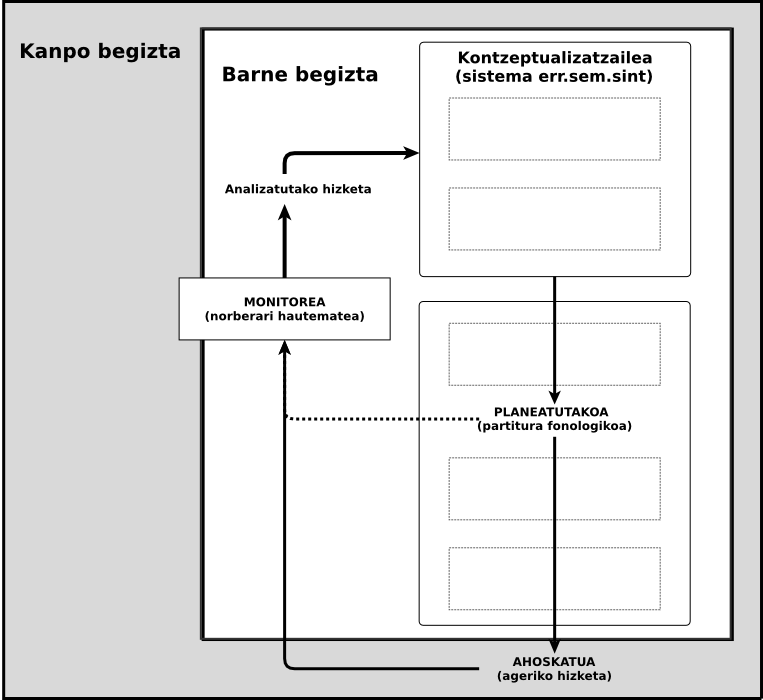

## Zailtasunak adizki jokatuaren inguruan B2-C1 ibilbidean

### Bilakaera kasu baten analisia

note:
Eskerrak tribunalari etorri izanagatik.

---

### Hasierarako ibilbidea

note:
**3'**  

Euskara irakasle hasi hile bi eta erdiko barnetegi baten ondoren.  
Ikastea eta irakastearen arteko sinbiosia.

euskara-**ikastun - irakasle**  
(intuizioa) Euskaraz pentsatzeko euskarazko elementuak  
Euskaraz berbetan nola ikasten den jakin nahi.

Euskara **irakasle - ikertzaile amateurra**  
Adizkiak erabiltzen nola ikasten den jakin nahi izatera.

**Irakasle eta ikertzaile** kontratua  
Zehatzago izan behar zuen: nola ikasten da adizkia ipintzen? Eta zerk ez du uzten horixe ikasten? Eta zer ikasten da? 

---

## (Zailtasunak + adizkiak) x gaitzea

---

##### Marko teorikoa
##### Hipotesiak
##### Marko metodologikoa
##### Azterketa
##### Interpretazioa
##### Ondorioak

---

##### Marko teorikoa
##### Hipotesiak
##### Marko metodologikoa
##### Azterketa
##### Interpretazioa
##### Ondorioak

---

## Zailtasunak adizki jokatuaren inguruan B2-C1 ibilbidean

+++?image=https://raw.githubusercontent.com/JuanAbasolo/irudiak/master/A01-EHnEuskara.png&size=auto 95%

+++

### Heldu euskaldunduak

| 1991 | 2014 |
|---|---|
| 16-24 | 35-49 |
| % 26.4 | % 29.3 |
|| ~ % 12.9 ?|

+++

**HABE 2014**
* B2 1350 gai
* C1 720 gai

+++

### Curriculum idatziak eta euskalduntze prozesua

|Curriculuma|Euskalduntzea|
|:---:|:---:|
|Diseinua|Gauzapena|
|Estudiatzea|Ikastea|
|Zer jakin|Zertan jakin|

+++?image=https://raw.githubusercontent.com/JuanAbasolo/irudiak/master/BaVsHEOC.png&size=auto 70%

---
## Zailtasunak adizki jokatuaren inguruan B2-C1 ibilbidean

+++

### Euskarazko adizki jokatua

Aditz erroa

Aspektua

**Pertsona**

**Numeroa**

**Modua**

**Tenpusa**

+++

### Nik zuri liburuak gaur _eman**go n-i-zki-zu-ke**_

### Lanean _**d-ihardu-t**_ 

---

## Zailtasunak adizki jokatuaren inguruan B2-C1 ibilbidean

+++

### Zailtasunak = zalantzak + zuzenketak + erroreak

+++?image=Levelten_eredua_Nik-garden.png&size=auto 95%

+++

### Zailtasunak = zalantzak + zuzenketak + erroreak

+++

Soinu luzatuak

Silabatze markatuak

? Eten beteak

? Eten isilak

? Errepikapenak

+++

### Zailtasunak = zalantzak + zuzenketak + erroreak

+++

? Errepikapenak

Osatu gabeko berbak

Birformulazioak

note:
Birfomulazioa = ageriko autozuzenketa

+++

### Zailtasunak = zalantzak + zuzenketak + erroreak

note:

* erroreak garapenean / ikaskuntza prosezuan
* erroreak (errakuntzak)

Sailkapena:

* Eza (zerbaiten falta)
* Gehitzea (zerbait sobran)
* Alegiazko hautua (okerreko elementua hautatzea)
* Okerreko ordena

+++

## Zailtasunen
# Continuuma

### zalantzak ←→ zuzenketak ←→ erroreak

---

## Zailtasunak adizki jokatuaren inguruan B2-C1 ibilbidean

note: 
gero azalduko da metodologian

### nik eeeez nion esan

---

##### Marko teorikoa
##### Hipotesiak
##### Marko metodologikoa
##### Azterketa
##### Interpretazioa
##### Ondorioak

---

### Hipotesiak

note:
**10'**

+++

### Hipotesi orokorra

> Ikasleak komunikazio gaitasuna garatu ahala bere baitako gaitasun linguistikoa ere garatuko duenez, gramatika ezaugarriek adizki jokatuen ekoizpenean eragiten dizkien zailtasunak urritu egingo dira

+++

### Hipotesi zehatzak

+++

##### Ikuspegi orokorretik hartuta

> H1 : Zailtasun adierazleen banaketa aldatuko da adizki jokatua, adizki nagusia, aditz argumentu ala beste ezer izan.

+++

##### Aditz nagusian eta laguntzailean

> H2 : Adizki laguntzailearen inguruan zailtasun adierazle gehiago egongo dira aditz nagusiaren inguruan baino.

+++

##### Adizki jokatuaren aurreko etenaz

> H3 : Zailtasun adierazleen banaketa eta adizki jokatuaren aurreko etenarena erlazionatuta egongo dira.

+++

##### Erroreak eta errakuntzak

> H4 : Nahiz eta arauen araberako adizkiak batzuetan sortu ez, horiek ez dira erroreak izango, huts egiteak baino; sortu behar zituzkeen adizki horiek arauen arabera ere aurkituko baititugu B2 mailatik gora dabilen ikastunaren ekoizpenean.

+++

##### Ezaugarri zailak

> H5 : Bada ezaugarri morfologiko, semantiko eta pragmatiko multzo bat zeinetan adizki jokatuaren inguruko zailtasunek banaketa bereizia duten.

note:

*Ezaugarri morfologikoak*

H5a : Adizki jokatuaren inguruan zailtasun adierazle gehiago agertuko
dira adizki markatuekin ez markatuekin baino

*Ezaugarri semantikoak*

H5b : Adizki jokatu inergatiboak zailtasun adierazle gehiago izango
ditu inguruan, ergatiboak eta inakusatiboak baino.
H5c : Aditz perifrastikoetan zailtasun adierazle gehiago egongo dira
adizki jokatuaren inguruan, aditz trinkoetan baino.

*Ezaugarri pragmatikoak*

H5d : Gertaldi gutxiagoko adizki formek zailtasun adierazle gehiago
izango dituzte inguruan, gertaldi gehiagokoek baino.
H5e : Adizki jokatuaren inguruko zailtasunak gutxiago izango dira,
aditz argumentuak formulatuta daudenean.
H5f : Aditz argumentuak formulatzen direnetik zenbat eta denbora
gehiago pasatu, zailtasun adierazle gehiago ikusiko dira adizki
jokatuaren inguruan

+++

##### Bilakaera

> H6 : Adizki jokatuaren inguruan zailtasun adierazle gutxiago egongo dira eta urrunago, mailaz igo ahala.

note:
**16'**

---

##### Marko teorikoa
##### Hipotesiak
##### Marko metodologikoa
##### Azterketa
##### Interpretazioa
##### Ondorioak

---

### Subjektu Bakarreko Diseinua

Neurketa sistematikoa aldi desberdinduetan.

note:
aldagai askea egon ala ez

+++

#### Batezbestekoa - Joera - Aldakortasuna

note:
EHUn gutxi erabilia, antza, ibilbide handia beste inguru batzuetan.  
Elementuak bakarka aztertzen ditu. Horretarako, delako ezaugarria neurtzen da aldi desberdinetan

+++

note:
Gehitze errorea. Lanetik aterata

---

### Datuak

Note:

Barnetegian

Ikastun bat 

13 monologo

330 egunean zehar

1000 klase orduan

---

#### Transkripzioak 

* Praat

* Etiketak
  * Zailtasun adierazleak
  * Etiketa sintaktikoak-eta beste

* Banaketa kokatu

> hori (·) esaaaan zidan

* Banaketaren analisia

note: 
## Praat

Informazio aberatsa (soinuaren ezaugarri fisikoez)

## Etiketak 

Zailtasun adierazleak:

* soinu luzatuak
* errepikapena
* berba zatiak
* erroreak
* ...

Etiketa sintaktikoak-eta

* Adizki jokatua
* Adizki nagusia
* Aditz argumentua (zein)
* Beste
* Amaiera tonua
* Formulazioaren amaiera

* Banaketa kokatu

---

##### Marko teorikoa
##### Hipotesiak
##### Marko metodologikoa
##### Azterketa
##### Interpretazioa
##### Ondorioak

---

### Zailtasunen distribuzioa corpuseko elementuetan zehar

+++?image=https://raw.githubusercontent.com/JuanAbasolo/irudiak/master/C-Zalantzak_danak.png&size=auto 80%

---

### Zailtasunak adizkiaren inguruan

+++?image=https://raw.githubusercontent.com/JuanAbasolo/irudiak/master/LaburBW-Zailtasun%20adierazleen%20distribuzioa%20eta%20adizki%20jokatua01.png&size=auto 90%

---

### Erroreak errakuntza
+++

IRUDIA

---

### Adizki jokatuen ezaugarriak eta zailtasunak

+++?image=https://raw.githubusercontent.com/JuanAbasolo/irudiak/master/LaburBW-ezaug.png&size=auto 90%

---

### Zailtasunen agerreraren bilakaera

+++?image=https://raw.githubusercontent.com/JuanAbasolo/irudiak/master/LaburBW-AB-aldea01.png&size=auto 90%

---

##### Marko teorikoa
##### Hipotesiak
##### Marko metodologikoa
##### Azterketa
##### Interpretazioa
##### Ondorioak

---

## Interpretazioa

note:
Adizkiak ekoiztea eta erabiltzea zaila da ikasle honentzat, behintzat. 

+++

> (*nikpro*) kirol gehiago egiten egiten dut

note:
*kirol gehiago* eta *egiten* erraz. Ez dakigu, baina, zer dagoen horren atzean.

+++

Zailtasunak taldeka

> entzuteeen (0.8seg) eeh dugu

+++

Adizki jokatuaren aurreko etena

### = 

zailtasun adierazlea

+++

Ezaugarri pragmatikoak

note:
* maiztasuna
* aurrez ahozkatutako argumentuak

+++

Errakuntzak Vs garapeneko erroreak

+++

Gaituago... zertan?

---

##### Marko teorikoa
##### Hipotesiak
##### Marko metodologikoa
##### Azterketa
##### Interpretazioa
##### Ondorioak

---

## Ondorioak

note:
Hipotesien berrikuspena

+++

**H1:** bete da

**H2:** bete da

**H3:** bete da

**H4:** bete dela ematen du

**H5:** bete da

**H6:** ez da bete

---

## Mugak

| SBD | Ing. | Transk. | Met. | Tamaina |
|:----:|:----:|:---:|:---:|:---:|
| A aldia| Formala| Bakarra| Doitzeko | Gehitzeko |

note:
30'

---

## Proposamenak

note:
Didaktika eta ikerketa

## Osotarako proposamenak gehiegizko balentria?

+++

### Didaktikarako

Hizkuntzaren __ezaugarri tenporalak__ era metodiko eta zehaztuan sartu

Zailtasunak era kontziente eta sistematikoan identifikatu (gaitasun estrategikoa)

+++

### Ikerketa

__Zabalago__

__Sakonago__

__Gehiago__

__Beste elementu batzuk__: prosodiaren lanketa.

---

## Zailtasunak adizki jokatuaren inguruan B2-C1 ibilbidean

### Bilakaera kasu baten analisia

note:
Eskerrak..
* Tribunalari
* Andoniri
* Laurari
* Barnetegiko eta eskolako lagunei
* Itziar
